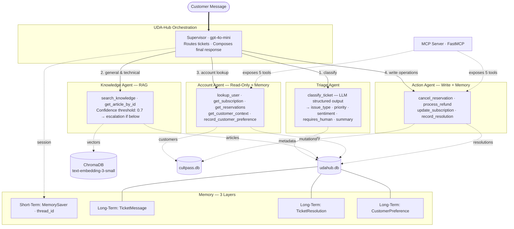
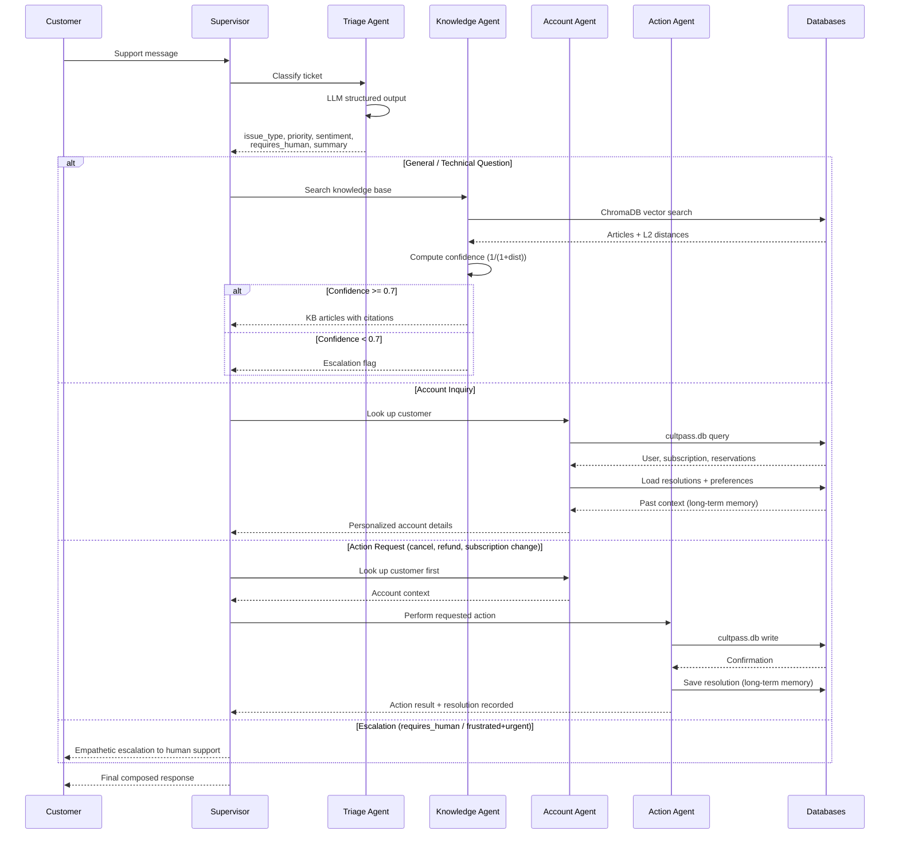

# UDA-Hub Architecture Diagrams

## System Architecture

```mermaid
graph TD
    User([Customer Message]) ==> Sup

    subgraph core[UDA-Hub Orchestration]
        Sup[Supervisor · gpt-4o-mini<br/>Routes tickets · Composes final response]
    end

    Sup -->|1. classify| TA
    Sup -->|2. general & technical| KA
    Sup -->|3. account lookup| AA
    Sup -->|4. write operations| XA

    subgraph tri["Triage Agent"]
        TA["classify_ticket — LLM structured output<br/>→ issue_type · priority · sentiment · requires_human · summary"]
    end

    subgraph know["Knowledge Agent — RAG"]
        KA["search_knowledge · get_article_by_id<br/>Confidence threshold: 0.7 → escalation if below"]
    end

    subgraph acct["Account Agent — Read-Only + Memory"]
        AA["lookup_user · get_subscription · get_reservations<br/>get_customer_context · record_customer_preference"]
    end

    subgraph act["Action Agent — Write + Memory"]
        XA["cancel_reservation · process_refund<br/>update_subscription · record_resolution"]
    end

    TA -.->|metadata| UH
    KA -.->|vectors| CH[(ChromaDB<br/>text-embedding-3-small)]
    KA -.->|articles| UH
    AA -.->|customers| CP[(cultpass.db)]
    AA -.->|memory| UH
    XA -.->|mutations| CP
    XA -.->|resolutions| UH[(udahub.db)]

    subgraph mem["Memory — 3 Layers"]
        direction LR
        S["Short-Term: MemorySaver · thread_id"]
        L1["Long-Term: TicketMessage"]
        L2["Long-Term: TicketResolution"]
        L3["Long-Term: CustomerPreference"]
    end

    Sup -.->|session| S
    UH --- L1 & L2 & L3

    MCP["MCP Server · FastMCP"] -.->|exposes 5 tools| AA & XA
```

## Agent Interaction Flow

```mermaid
sequenceDiagram
    participant C as Customer
    participant S as Supervisor
    participant T as Triage Agent
    participant K as Knowledge Agent
    participant A as Account Agent
    participant X as Action Agent
    participant DB as Databases

    C->>S: Support message
    S->>T: Classify ticket
    T->>T: LLM structured output
    T-->>S: issue_type, priority, sentiment,<br/>requires_human, summary

    alt General / Technical Question
        S->>K: Search knowledge base
        K->>DB: ChromaDB vector search
        DB-->>K: Articles + L2 distances
        K->>K: Compute confidence (1/(1+dist))
        alt Confidence >= 0.7
            K-->>S: KB articles with citations
        else Confidence < 0.7
            K-->>S: Escalation flag
        end
    else Account Inquiry
        S->>A: Look up customer
        A->>DB: cultpass.db query
        DB-->>A: User, subscription, reservations
        A->>DB: Load resolutions + preferences
        DB-->>A: Past context (long-term memory)
        A-->>S: Personalized account details
    else Action Request (cancel, refund, subscription change)
        S->>A: Look up customer first
        A-->>S: Account context
        S->>X: Perform requested action
        X->>DB: cultpass.db write
        DB-->>X: Confirmation
        X->>DB: Save resolution (long-term memory)
        X-->>S: Action result + resolution recorded
    else Escalation (requires_human / frustrated+urgent)
        S-->>C: Empathetic escalation to human support
    end

    S-->>C: Final composed response
```
